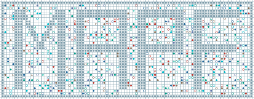

# awesome-mapf-projects

  

A list aiming to broadly cover excellent projects, papers, repositories, websites, and videos related to Multi-Agent Pathfinding (MAPF)

Contributions welcome! Feel free to open a pull-request!

## Contents
- [Papers](#papers)
    - [Survey](#survey)
    - [Search-based Approach](#search-based-approach)
    - [Sampling-based Approach](#sampling-based-approach)
    - [Learning-based Approach](#learning-based-approach)
    - [Hybrid Approach](#hybrid-approach)
- [Repositories](#repositories)
    - [Solver Implementations](#solver-implementations)
    - [Benchmarks](#benchmarks)
    - [Visualization Tools](#visualization-tools)
- [Websites](#websites)
- [Videos](#videos)

## Papers
### Survey

### Search-based Approach

### Sampling-based Approach

### Learning-based Approach

### Hybrid Approach

## Repositories
### Solver Implementations

### Benchmarks

### Visualization Tools

## Websites

## Videos

