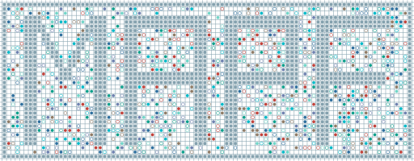

# awesome-mapf-resources

  

A list aiming to broadly cover excellent projects, papers, repositories, websites, and videos related to Multi-Agent Pathfinding (MAPF)

Contributions welcome! Feel free to open a pull-request!

## Contents
- [Papers](#papers)
    - [Survey](#survey)
    - [Search-based Approach](#search-based-approach)
    - [Sampling-based Approach](#sampling-based-approach)
    - [Learning-based Approach](#learning-based-approach)
    - [Hybrid Approach](#hybrid-approach)
    - [Others](#others)
- [Repositories](#repositories)
    - [Solver Implementations](#solver-implementations)
    - [Benchmarks](#benchmarks)
    - [Visualization Tools](#visualization-tools)
- [Websites](#websites)
- [Videos](#videos)

## Papers
### Survey
**Multi-Agent Path Finding – An Overview** \
Roni Stern \
2019, [[ResearchGate](https://www.researchgate.net/publication/336611576_Multi-Agent_Path_Finding_-_An_Overview)] 

**Multi-Agent Pathfinding: Definitions, Variants, and Benchmarks** \
Roni Stern, Nathan Sturtevant, Ariel Felner, Sven Koenig, Hang Ma, Thayne Walker, Jiaoyang Li, Dor Atzmon, Liron Cohen, T. K. Satish Kumar, Eli Boyarski, Roman Bartak \
2019, [[arXiv](https://arxiv.org/abs/1906.08291)] 

**Problem Compilation for Multi-Agent Path Finding: a Survey** \
Pavel Surynek \
2022, [[IJCAI](https://www.ijcai.org/proceedings/2022/783)] [[video](https://www.ijcai.org/proceedings/2022/video/783)] 

**A Comprehensive Review on Leveraging Machine Learning for Multi-Agent Path Finding** \
Jean-Marc Alkazzi, Keisuke Okumura \
2024, [[ResearchGate](https://www.researchgate.net/publication/380014238_A_Comprehensive_Review_on_Leveraging_Machine_Learning_for_Multi-Agent_Path_Finding)] 

**Where Paths Collide: A Comprehensive Survey of Classic and Learning-Based Multi-Agent Pathfinding** \
Shiyue Wang, Haozheng Xu, Yuhan Zhang, Jingran Lin, Changhong Lu, Xiangfeng Wang, Wenhao Li \
2025, [[arXiv](https://arxiv.org/abs/2505.19219)] 

### Search-based Approach
**Finding Optimal Solutions to Cooperative Pathfinding Problems** \
Trevor Standley \
2010, [[AAAI](https://ojs.aaai.org/index.php/AAAI/article/view/7564)]

**Conflict-based search for optimal multi-agent pathfinding** (CBS)\
Guni Sharon, Roni Stern, Ariel Felner, Nathan R. Sturtevant \
2015, [[ScienceDirect](https://www.sciencedirect.com/science/article/pii/S0004370214001386)] 

**Suboptimal Variants of the Conflict-Based Search Algorithm for the Multi-Agent Pathfinding Problem** (ECBS)\
Max Barer, Guni Sharon, Roni Stern, Ariel Felner
2015, [[AAAI](https://ojs.aaai.org/index.php/SOCS/article/view/18315)]

**ICBS: Improved Conflict-Based Search Algorithm for Multi-Agent Pathfinding** (ICBS) \
Eli Boyarski, Ariel Felner, Roni Stern, Guni Sharon, Oded Betzalel, David Tolpin, Eyal Shimony
2015, [[AAAI](https://ojs.aaai.org/index.php/SOCS/article/view/18343)]

**Subdimensional expansion for multirobot path planning** (M\*)\
Glenn Wagner, Howie Choset \
2015, [[ScienceDirect](https://www.sciencedirect.com/science/article/pii/S0004370214001271)] 

<!-- **Disjoint Splitting for Multi-Agent Path Finding with Conflict-Based Search** \
Jiaoyang Li, Daniel Harabor, Peter J. Stuckey, Ariel Felner, Hang Ma, Sven Koenig \
2019, [[AAAI](https://ojs.aaai.org/index.php/ICAPS/article/view/3487)] 

**Improved Heuristics for Multi-Agent Path Finding with Conflict-Based Search** \
Jiaoyang Li, Ariel Felner, Eli Boyarski, Hang Ma, Sven Koenig \
2019, [[IJCAI](https://www.ijcai.org/proceedings/2019/63)] 

**Searching with Consistent Prioritization for Multi-Agent Path Finding** \
Hang Ma, Daniel Harabor, Peter J. Stuckey, Jiaoyang Li, Sven Koenig \
2019, [[DOI](https://doi.org/10.1609/aaai.v33i01.33017643)] -->

**Multi-Agent Pathfinding with Continuous Time** (CCBS) \
Anton Andreychuk, Konstantin Yakovlev, Dor Atzmon, Roni Stern \
2019, [[arXiv](https://arxiv.org/abs/1901.05506)]

**EECBS: A Bounded-Suboptimal Search for Multi-Agent Path Finding** (EECBS)\
Jiaoyang Li, Wheeler Ruml, Sven Koenig \
2021, [[DOI](https://doi.org/10.1609/aaai.v35i14.17466)] 

**Anytime Multi-Agent Path Finding via Large Neighborhood Search** (MAPF-LNS) \
Jiaoyang Li, Zhe Chen, Daniel Harabor, Peter J. Stuckey and Sven Koenig1 \
2021, [[IJCAI](https://www.ijcai.org/proceedings/2021/568)] [[code](https://github.com/Jiaoyang-Li/MAPF-LNS)]

**MAPF-LNS2: Fast Repairing for Multi-Agent Path Finding via Large Neighborhood Search** (MAPF-LNS2)\
Jiaoyang Li, Zhe Chen, Daniel Harabor, Peter J. Stuckey, Sven Koenig \
2022, [[AAAI](https://ojs.aaai.org/index.php/AAAI/article/view/21266)] [[code](https://github.com/Jiaoyang-Li/MAPF-LNS2)]

**LaCAM: Search-Based Algorithm for Quick Multi-Agent Pathfinding** (LaCAM)\
Keisuke Okumura \
2022, [[arXiv](https://arxiv.org/abs/2211.13432)] [[website](https://kei18.github.io/lacam/)] [[code](https://github.com/Kei18/lacam)]

**Improving LaCAM for Scalable Eventually Optimal Multi-Agent Pathfinding** (LaCAM\*)\
Keisuke Okumura \
2023, [[arXiv](https://arxiv.org/abs/2305.03632)] [[website](https://kei18.github.io/lacam2/)] [[code](https://github.com/Kei18/lacam2)]

### Sampling-based Approach
<!-- **Multi-agent RRT: Sampling-based Cooperative Pathfinding (Extended Abstract)** \
Joshua M. Otte, Nikolaus Correll \
2013, [[arXiv](https://arxiv.org/abs/1302.2828)] 

**Cooperative Pathfinding Based on Memory-Efficient Multi-Agent RRT\*** \
Jinmingwu Jiang, Kaigui Wu \
2020, [[DOI](https://doi.org/10.1109/ACCESS.2020.3023200)]  -->

### Learning-based Approach
**PRIMAL: Pathfinding via Reinforcement and Imitation Multi-Agent Learning** (PRIMAL) \
Guillaume Sartoretti, Justin Kerr, Yunfei Shi, Glenn Wagner, T. K. Satish Kumar, Sven Koenig, Howie Choset \
2019, [[arXiv](https://arxiv.org/abs/1809.03531)] [[code](https://github.com/gsartoretti/PRIMAL)]

**PRIMAL2: Pathfinding via Reinforcement and Imitation Multi-Agent Learning -- Lifelong** (PRIMAL2) \
Mehul Damani, Zhiyao Luo, Emerson Wenzel, Guillaume Sartoretti \
2020, [[arXiv](https://arxiv.org/abs/2010.08184)] [[code](https://github.com/marmotlab/PRIMAL2)]

**Message-Aware Graph Attention Networks for Large-Scale Multi-Robot Path Planning** (MAGAT)\
Qingbiao Li, Weizhe Lin, Zhe Liu, Amanda Prorok \
2021, [[arXiv](https://arxiv.org/abs/2011.13219)] [[code](https://github.com/proroklab/magat_pathplanning)]

**CTRMs: Learning to Construct Cooperative Timed Roadmaps for Multi-agent Path Planning in Continuous Spaces** (CTRM) \
Keisuke Okumura, Ryo Yonetani, Mai Nishimura, Asako Kanezaki \
2022, [[arXiv](https://arxiv.org/abs/2201.09467)] [[website](https://omron-sinicx.github.io/ctrm/)] [[code](https://github.com/omron-sinicx/ctrm)]

**SCRIMP: Scalable Communication for Reinforcement- and Imitation-Learning-Based Multi-Agent Pathfinding** (SCRIMP)\
Yutong Wang, Bairan Xiang, Shinan Huang, Guillaume Sartoretti \
2023, [[arXiv](https://arxiv.org/abs/2303.00605)] [[code](https://github.com/marmotlab/SCRIMP)]

**MAPF-GPT: Imitation Learning for Multi-Agent Pathfinding at Scale** (MAPF-GPT)\
Anton Andreychuk, Konstantin Yakovlev, Aleksandr Panov, Alexey Skrynnik \
2024, [[arXiv](https://arxiv.org/abs/2409.00134)] [[website](https://sites.google.com/view/mapf-gpt/)] [[code](https://github.com/CognitiveAISystems/MAPF-GPT)]

**Advancing Learnable Multi-Agent Pathfinding Solvers with Active Fine-Tuning** (MAPF-GPT-DDG)\
Anton Andreychuk, Konstantin Yakovlev, Aleksandr Panov, and Alexey Skrynnik \
2025, [[arXiv](https://arxiv.org/abs/2506.23793)] [[website](https://sites.google.com/view/mapf-gpt-ddg)] [[code](https://github.com/Cognitive-AI-Systems/MAPF-GPT-DDG)]

**Pairwise is Not Enough: Hypergraph Neural Networks for Multi-Agent Pathfinding** (HMAGAT)\
Rishabh Jain, Keisuke Okumura, Michael Amir, Pietro Lio, Amanda Prorok \
2025, [[arXiv](https://arxiv.org/abs/2602.06733)] [[code](https://github.com/proroklab/hmagat)]

### Hybrid Approach
**Learning to Resolve Conflicts for Multi-Agent Path Finding with Conflict-Based Search** (ML-guided CBS)\
Taoan Huang, Sven Koenig, Bistra Dilkina \
2021, [[arXiv](https://arxiv.org/abs/2012.06005)] 

**LNS2+RL: Combining Multi-agent Reinforcement Learning with Large Neighborhood Search in Multi-agent Path Finding** (LNS2+RL)\
Yutong Wang, Tanishq Duhan, Jiaoyang Li, Guillaume Sartoretti \
2025, [[arXiv](https://arxiv.org/abs/2405.17794)] 

**Graph Attention-Guided Search for Dense Multi-Agent Pathfinding** (LaGAT)\
Rishabh Jain, Keisuke Okumura, Michael Amir, Amanda Prorok \
2025, [[arXiv](https://arxiv.org/abs/2510.17382)] [[code](https://github.com/proroklab/lagat)]

### Others
<!-- #### Multi-Agent Pickup and Delivery(MAPD)
**Lifelong Multi-Agent Path Finding for Online Pickup and Delivery Tasks** \
Hang Ma, Wolfgang Hoenig, T. K. Satish Kumar, Sven Koenig \
2017, [[arXiv](https://arxiv.org/abs/1705.10868)] 

**Lifelong Multi-Agent Path Finding in Large-Scale Warehouses** \
Jiaoyang Li, Andrew Tinka, Scott Kiesel, Joseph W. Durham, T. K. Satish Kumar, Sven Koenig \
2021, [[AAAI](https://ojs.aaai.org/index.php/AAAI/article/view/17344)] 

**Task assignment strategies for capacitated agents engaged in lifelong pickup and delivery tasks** \
Evren Cilden, Faruk Polat \
2025, [[DOI](https://doi.org/10.1016/j.knosys.2025.114281)] 

#### Multi-Agent Warehouse Rearrangement(MAWR)
**From Agent Centric to Obstacle Centric Planning: A Makespan-Optimal Algorithm for the Multi-Agent Warehouse Rearrangement Problem** \
Yaakov Sherma, Eyal Weiss, Oren Salzman \
2025, [[AAAI](https://ojs.aaai.org/index.php/SOCS/article/view/35985/38140)]  -->

## Repositories
### Solver Implementations

### Benchmarks

### Visualization Tools

## Websites

## Videos
